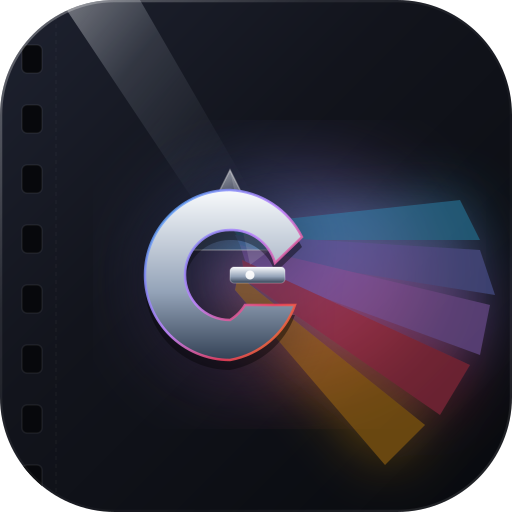

# GPDb · 超高速・プライバシー最優先のゲイアダルト映像データベース管理クライアント

<p align="center">
  
</p>

<p align="center">
  <strong>ゲイアダルト映像愛好家とコレクターのために作られた、ハイパフォーマンス・全次元プロファイル管理・完全プライバシー＆ゼロクラウド追跡の最新オフライン管理クライアント</strong>
</p>

<p align="center">
  <a href="./README.md">简体中文</a> |
  <a href="./README_EN.md">English</a> |
  <a href="./README_ZH_TW.md">繁體中文</a> |
  <a href="./README_JA.md"><b>日本語</b></a> |
  <a href="./README_DE.md">Deutsch</a> |
  <a href="./README_ES.md">Español</a> |
  <a href="./README_IT.md">Italiano</a>
</p>

<p align="center">
  
  
  
  
  
  
</p>

---

## 📖 プロジェクト概要 (About GPDb)

**GPDb**（Gay Pornography Database Manager）は、**ゲイアダルトメディア（Gay Adult Media）**のファン、デジタルコレクター、映像リサーチャー向けに特化して開発された、**高性能・高機能オフラインデータベース管理クライアント**です。

成人向けメディアの領域において、個人の視聴履歴、お気に入りリスト、嗜好性は**最もデリケートで重要なプライバシー**です。商用配信サービスやクラウド型プラットフォームでは、閲覧データの追跡、アカウント漏洩、ライセンス終了による作品消失などのリスクが常に存在します。

**GPDb は「100% ローカル優先（Offline-First）と痕跡を残さない完全なプライバシー」をコア哲学に設計されています**：
- **クラウドへの依存度ゼロ**：すべてのメタデータ、出演者の身体プロファイル、ポスターやサムネイル画像、レーティングやブックマークは、ユーザー自身の端末内にのみ保存されます。
- **純粋なローカルアーキテクチャ**：アカウント登録不要、アクセスログの収集なし、外部サーバーへの通信・トラッキングコードは一切含まれません。
- **圧倒的なパフォーマンス**：高性能 **Rust コアエンジン (`gpdb-core`)** と **Tauri v2 + Vue 3** の現代的アーキテクチャを採用。**60,000本以上の本編作品、100,000本以上の個別シーン、6,000名以上のモデル身体データ、1,300以上のレーベル・メーカー**に対しても、60fps の滑らかな描画とミリ秒単位の即時検索を実現しています。

---

## ✨ 領域特化のコア機能 (Domain-Specific Features)

### 1. 多次元の身体属性・身体特徴による詳細検索
- **極めて精密な体型・身体特徴フィルター**：
  **体型・ビルド**（Muscle / Twink / Bear / Hunk など）、**髪色**、**瞳の色**、**ヒゲや体毛の濃さ**、**身長・体重**、**肌の色**、**サイズ・包茎/割礼（Foreskin）状態**、**タトゥーやピアス**など、多角的な条件で横断絞り込みが可能です。
- **別名・名義の自動集約（Aliases）**：
  同一モデルが所属スタジオや年代によって使い分ける異なる芸名・別名を自動的に名寄せし、出演作の検索漏れを防ぎます。
- **本編（Films）と単体シーン（Scenes）の精密区分**：
  長編本編作品の主演クレジットと、オムニバス形式の短編シーン出演を明確に区別して閲覧できます。

### 2. ストリーミングサービス級の没入型ホーム画面 (Home Feed)
- **大画面ポスターカルーセル**：高解像度ポスターがパララックスアニメーションとともに滑らかに自動巡回。
- **あの日の名作（On This Day）**：カレンダーと連動し、1980年代・1990年代・2000年代の黄金期に同日公開された名作をプレイバック。
- **スターライト（Starlight Today）**：ローカルキャッシュを厳格に照合し、鮮明なポートレート画像を持つ名優たちをフィーチャー。文字プレースホルダーの混入を防ぎます。
- **名作シリーズ特集**：10作以上続く名作長編フランチャイズを自動ピックアップ。
- **ランダムダイス探索**：サイコロを振って、6万本以上のアーカイブから未知の隠れた名作を発見。

### 3. スマートシリーズ自動集約＆コラージュカバー (Smart Series & Collage Covers)
- **自動クラスタリング**：ローマ数字やサブタイトルを解析し、分散したシリーズ作品（例：*Part I, Part II, Part III*）をひとつのコレクションに自動統合。
- **アダプティブ・アートコラージュ**：シリーズ内の作品数に応じて、1枚ポスター、2分割シンメトリー、3段ステップ、4分割グリッドのコラージュカバーを自動生成。オフラインで瞬時に美しくレンダリングします。

### 4. 監督プロフィール＆スタジオ図鑑
- **監督アーカイブ**：作品詳細から監督カードを呼び出し、監督作一覧の閲覧やライブラリの一発フィルタリングが可能。
- **包括的スタジオカタログ**：往年のクラシックフィルムメーカー（Falcon, Colt, Catalinaなど）から現代の大手メーカー（Men.com, BelAmi, Lucas Entertainment, Corbin Fisherなど）まで、リリース年表と特徴を完全網羅。

### 5. AI 映画ファン嗜好洞察・美的プロファイリング (AI Persona Insights)
- **完全非同期処理**：UIのフリーズを一切引き起こすことなく、バックグラウンドスレッドでローカル/リモートLLM（DeepSeek、OpenAI、Claudeなど）と安全に通信。
- **深層審美レポート**：ユーザーの私的なお気に入りやタグ履歴から美的好みを分析し、「ネオ・クラシック探求者」といった審美コードネームや、約2000字の詳細な鑑賞批評レポートを生成。
- **すりガラス調プログレスモーダル**：トークン化、足跡分析、プロファイル生成の工程をリアルタイムに視覚化。

### 6. リソース検索＆外部拡張プラグイン (v2.0)
- **ワンクリック外部アクセス**：作品やモデルの英語原名を用いて、BoyfriendTV、Google、大手映像データベースの検索ページへダイレクト遷移。
- **BT マグネット生成**：メーカー名と作品名を標準検索構文に変換し、外部エンジンに橋渡し。
- **個別トグル制御**：設定・プラグイン画面で各外部サイトボタンを自由にオン/オフ設定可能。

### 7. 多言語ローカライズ＆ゲーミフィケーション実績システム
- **7カ国語完全対応**：簡体字中国語 (`zh-CN`)、繁体字中国語 (`zh-TW`)、英語 (`en`)、イタリア語 (`it`)、日本語 (`ja`)、スペイン語 (`es`)、ドイツ語 (`de`)。
- **PlayStation スタイル実績トロフィー**：探索や収集のやり込みに応じてトロフィーが解除され、PSN風のすりガラスフロート演出が表示されます。

---

## 🛠️ 技術スタック (Technology Stack)

```
┌─────────────────────────────────────────────────────────────┐
│                   フロントエンド UI レイヤー                 │
│  Vue 3 + Vite + TypeScript + Tailwind CSS + Lucide Icons   │
│   (レスポンシブグリッド、すりガラスエフェクト、i18n、状態管理) │
└──────────────────────────────┬──────────────────────────────┘
                               │ (Tauri IPC / 高速バイナリブリッジ)
┌──────────────────────────────▼──────────────────────────────┐
│                    Tauri v2 ホストレイヤー                  │
│ カスタムプロトコル (gpdb-img://)、ウィンドウ制御、ファイル選択 │
└──────────────────────────────┬──────────────────────────────┘
                               │ (Rust Native インターフェース)
┌──────────────────────────────▼──────────────────────────────┐
│                 Rust コアエンジン (gpdb-core)               │
│ • 動的 SQL クエリビルダー＆あいまい検索 (rusqlite)          │
│ • マルチレイヤー画像物理検証＆ローカルキャッシュリゾルバ     │
│ • 非同期バックグラウンド実行＆LLM ランタイム                │
│ • スキーマ自動マイグレーション＆セルフヒーリング            │
└──────────────────────────────┬──────────────────────────────┘
                               │
┌──────────────────────────────▼──────────────────────────────┐
│                   永続化ストレージレイヤー                  │
│      gevi.db (SQLite 3 WAL モード) + image_cache/ (ローカル) │
└─────────────────────────────────────────────────────────────┘
```

---

## 🚀 クイックスタート (Quick Start)

### 一般ユーザー向け（推奨）

[Releases ページ](../../releases) からビルド済みのインストーラーをダウンロードしてください：
- **macOS**：`GPDb-macOS-v2.0.dmg` をダウンロードし、マウント後に `GPDb.app` を `Applications` フォルダへドラッグ＆ドロップします。
- **Android**（開発進行中）：`.apk` パッケージを端末にダウンロードしてインストールします。

### 開発者向けローカルビルド手順

#### 動作環境
- Node.js 20+ および npm
- Rust 1.78+ (`cargo`)
- macOS 12+ (Apple Silicon Mシリーズおよび Intel x86_64 両対応)

#### ビルド手順
```bash
# 1. リポジトリをクローン
git clone https://github.com/littlebighero/GPDb.git
cd GPDb

# 2. デスクトップクライアントディレクトリに移動
cd desktop_client

# 3. 依存パッケージのインストール
npm install

# 4. 開発モードで起動
npm run tauri dev

# 5. プロダクション配布用パッケージのビルド (.app および .dmg)
npm run tauri build
```

---

## ⚖️ 免責事項と利用規約 (Disclaimer)

1. **ソフトウェアの性質**：
   本ソフトウェア（GPDb）は、個人のデジタルメディアコレクション向けの**オープンソース汎用オフラインメタデータインデックスおよびローカルデータベース管理ツール**です。
2. **コンテンツ非保持の原則**：
   本プロジェクトのソースコードおよび配布バイナリには、**著作権で保護された動画、音声、Torrentデータ、画像素材は一切含まれておらず、ホスティング・配信も行っていません**。テストデータや画面表示例は、スキーマ検証およびUIレンダリング確認のみを目的としています。
3. **利用者の自己責任原則**：
   本ツールを利用したローカルデータの管理、外部サイトへのアクセス、その他本ソフトウェアの使用に起因するすべての行為および法的責任は、利用者本人が負うものとします。
4. **法令遵守および年齢制限**：
   本ソフトウェアは成人年齢に達したユーザーのみを対象としています。ご利用の際は、お住まいの国や地域の関連法令を遵守してください。

---

## 📄 ライセンス (License)

本プロジェクトは [MIT License](LICENSE) のもとで公開されています。原作者の著作権表示および本免責条項を保持する限り、自由に利用・改変・再配布することが可能です。
