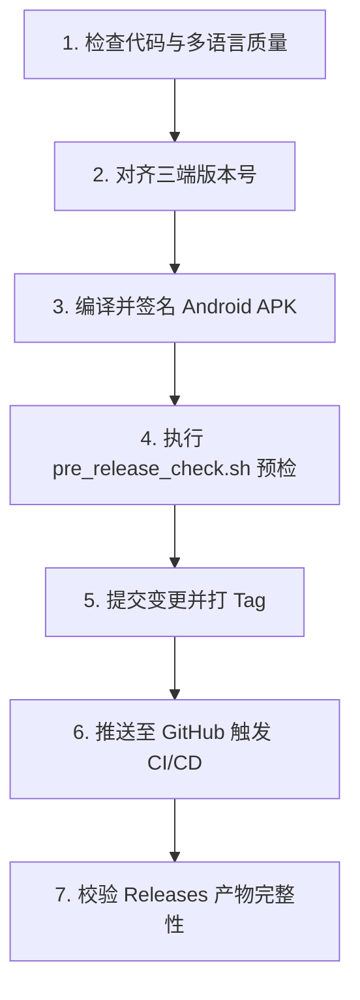

# GPDb Git 管理与版本发布规范 (Git Tasks & Release Workflow)

> **标准工作路径**：`/Users/joel/iCloud Drive (Archive)/Documents/antigravity/GPDb 开发`  
> **面向对象**：维护者、构建脚本与发版智能体。所有代码提交、分支管理及 GitHub Release 必须严格按照本规范执行。

---

## 1. 核心铁律与安全红线

1. **工作路径基准**：
   - 所有 Git 操作与文件读取必须严格定位至 `/Users/joel/iCloud Drive (Archive)/Documents/antigravity/GPDb 开发`。
   - 严禁回退或读取已归档的旧路径（如 `GEVI_Offline_Database`）。
2. **严禁泄露绝对隐私路径**：
   - 在任何公开文档（`README*.md`、发版 Release Notes 等）中，严禁出现开发者本地绝对路径（如 `/Users/joel/...`）。
   - 运行 `./git_tasks/pre_release_check.sh` 确保零泄露。
3. **公开文档排除 iOS 端描述**：
   - 依据当前策略，在所有公开的 `README*.md`、Release 说明与 Telegram 广播中，必须暂时排除 iOS 端相关内容，统一聚焦 **macOS、Windows、Android** 三端架构。
4. **Android APK 追踪规范**：
   - Git 仓库中仅强制追踪当前发布版本的签名 APK：`android_client/GPDb_Android_v<版本号>_release_signed.apk`（使用 `git add -f`）。
   - 旧版本签名 APK 必须及时执行 `git rm --cached` 移除暂存，保持仓库轻量。

---

## 2. 标准发版全流程 (Step-by-Step)



### 第一步：代码质量与 i18n 校验
```bash
# 1. 验证 desktop_client (macOS)
cd "desktop_client"
npm run build         # vue-tsc -b 严格类型检查 + vite build
cargo test            # gpdb-core 单元测试

# 2. 验证 Windows_client
cd "../Windows_client"
npm run build
python3 scripts/test_parity.py   # 7 语种 100% 镜像对称性测试
```

### 第二步：各端版本号对齐
需确保以下文件中的版本号统一一致（例如 `2.18.0`）：
- `desktop_client/package.json`
- `desktop_client/src-tauri/Cargo.toml`
- `desktop_client/src-tauri/tauri.conf.json`
- `desktop_client/src-tauri/gpdb-core/Cargo.toml`
- `Windows_client/package.json`
- `Windows_client/src-tauri/Cargo.toml`
- `Windows_client/src-tauri/tauri.conf.json`
- `Windows_client/src-tauri/gpdb-core/Cargo.toml`
- `android_client/app/build.gradle.kts` (`versionName = "2.18.0"`, `versionCode` 递增)

### 第三步：构建 Android 生产包
```bash
cd "android_client"
./gradlew assembleRelease
# 将生成的 app-release.apk 签名重命名为 GPDb_Android_v<版本号>_release_signed.apk
```

### 第四步：执行预检脚本
在项目根目录运行：
```bash
./git_tasks/pre_release_check.sh
```

### 第五步：Git 提交与打标
```bash
# 移除旧版 APK 暂存（如有）
git rm --cached android_client/GPDb_Android_v<旧版本>_release_signed.apk || true

# 暂存并提交更新
git add -f android_client/GPDb_Android_v<新版本>_release_signed.apk
git add .
git commit -m "release: v<新版本> <更新摘要>"

# 创建或更新 Annotated Tag
git tag -fa v<新版本> -m "Release v<新版本>: <更新描述>"
```

### 第六步：推送远程并触发 GitHub Actions
```bash
git push origin main
git push origin v<新版本> --force
```

### 第七步：CI/CD 产物验证
GitHub Actions (`.github/workflows/release.yml`) 将自动并发打包：
- **macOS**：`GPDb-macOS-v<版本号>.dmg`
- **Windows**：`GPDb-Windows-v<版本号>.exe`
- **Android**：自动随 macOS Job 挂载发布的 `GPDb-Android-v<版本号>-signed.apk`
确保 Release 页面三端安装包全部就绪。
