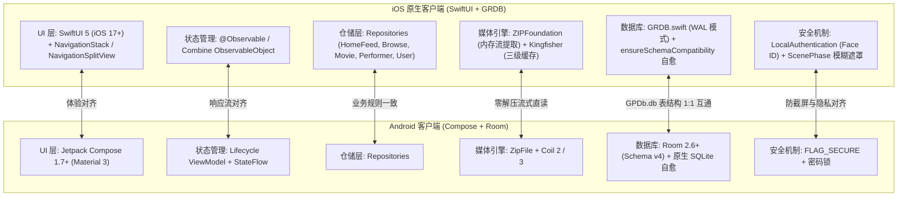
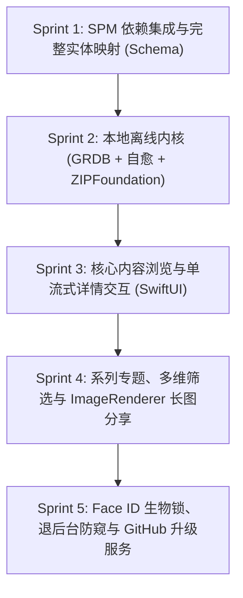

# GPDb iOS 架构设计规范与 Android 逻辑对照白皮书

本架构设计方案旨在确保 **iOS 原生客户端** 在功能完整度、数据兼容性与交互体验上与 **Android 客户端 (v2.15.0)** 保持 100% 体验对齐，同时严格遵循苹果 iOS 人机交互指南 (Human Interface Guidelines, HIG)。

---

## 一、核心技术决策与对标方案

### 1. 本地数据库引擎：GRDB.swift
- **对齐对象**：Android Room (SQLite 3)
- **底层架构**：直接连接沙盒或挂载的 `GPDb.db`。采用 `DatabaseQueue`，开启 WAL 并发读写模式。
- **挂载前置自愈机制 (`ensureSchemaCompatibility`)**：
  在连接建立前使用 SQLite 原生 C API 直连检查 `PRAGMA table_info(performers);`，自动补齐缺失列（`pbc_url`, `sj_url`）与扩展表（`performer_pbc_profiles`, `performer_sj_profiles`, `user_favorites`, `user_movie_data`），彻底根绝因历史数据库缺列导致的查询或挂载异常。
- **避免键冲突规范**：复刻 Android 经验，系列查询严格执行 `DISTINCT`，并在 UI 层采用 `id ?: "\(studioName)_\(rootTitle)_\(hashValue)"` 作为 ForEach 复合唯一标识符。

### 2. 压缩图库流式读取：ZIPFoundation + Kingfisher
- **对齐对象**：Android `ZipImageFetcher` (Coil 3)
- **核心痛点**：`GPDb_Images.zip` 体积高达 15GB+，若在手机内解压将耗尽存储且消耗数十分钟。
- **技术实现**：
  1. 通过 iOS `UIDocumentPickerViewController` 或 iTunes 文件共享将 `GPDb_Images.zip` 导入沙盒 Documents 或保存 Security-Scoped Bookmark；
  2. 使用 `ZIPFoundation` 提供的 `Archive` 类按 entry 路径流式抽取（`archive.extract(entry) { data in ... }`）；
  3. 实现 Kingfisher 的 `ImageDataProvider` 接口，解压出的 `Data` 直接转为 `UIImage` 并压入 Kingfisher 内存 LRU 与磁盘缓存。

### 3. 分享卡片离屏渲染：SwiftUI `ImageRenderer`
- **对齐对象**：Android Compose `rememberGraphicsLayer` / 桌面端 Canvas 降采样
- **技术实现**：
  - 使用纯 SwiftUI 构建自适应长卡片 `ShareCardView`；
  - 采用流光自适应渐变作为统一背景；
  - 分集剧照应用 16:9 展台与 `.scaledToFill()` 居中防形变裁切；
  - 演职员阵容与长剧情简介自然弹性排版；
  - 底角集成 27×27 标准高保真点阵二维码，直连官方频道 `https://t.me/gpdbnews`；
  - 调用 `ImageRenderer(content: cardView).uiImage` 生成 3x Retina 高清晰度长图并写入系统相册 (`PHPhotoLibrary`)。

### 4. 隐私安全体系：Face ID + 隐私遮罩
- **对齐对象**：Android `FLAG_SECURE` + 密码锁
- **技术实现**：
  - 监听 SwiftUI 的 `@Environment(\.scenePhase)`；
  - 当状态为 `.inactive` 或 `.background` 时，自动覆盖 `.ultraThinMaterial` 高斯模糊视窗；
  - 恢复至 `.active` 时触发 `LAContext().evaluatePolicy(.deviceOwnerAuthenticationWithBiometrics)` 进行生物识别认证；
  - 主页顶部导航栏配置即时防窥图标按钮，点击即可对全局海报与剧照进行高斯模糊脱敏。

---

## 二、5 个 Sprint 迭代路线规划

### Sprint 1：工程基石与实体映射
- 建立 SPM 依赖清单（GRDB 6.x、ZIPFoundation、Kingfisher）；
- 精准映射 `movies` (21列)、`performers`、`episodes`、`performer_pbc_profiles`、`performer_sj_profiles`、`series_collections`、`user_favorites`、`user_movie_data`、`glossaries` 等实体结构；
- 配置 App 入口与全局环境对象 `AppEnvironment`。

### Sprint 2：存储与图片管道
- 实现 `DatabaseHolder.swift`，内置原生 SQLite `ensureSchemaCompatibility` 自愈逻辑，验证沙盒 `GPDb.db` 读写；
- 实现 `ZipImageProvider.swift`，打通内存流海报解码与 Kingfisher 缓存对接；
- 编写 Repositories 业务层（`HomeFeedRepository`, `BrowseRepository`, `MovieRepository`, `PerformerRepository`, `UserRepository`）。

### Sprint 3：核心视图与单流式架构
- 首页 Feed 流（焦点轮播、AI 导赏、今日星光头像过滤、随机系列大放送、盲盒抽卡）；
- 影片详情页（双封面、3D翻转画廊、中英简介、演职员名单、评星笔记）；
- 演员档案页（**采用单流式 Lazy 布局架构**，档案卡片与 Tab 顶置，彻底杜绝头部折叠与滚动冲突，PBC/SJ 资料融合）。

### Sprint 4：进阶检索、专题与长图分享
- 分类检索与多维筛选（三级降级检索，原生 PresentationDetents 底部抽屉，右侧字母悬浮索引条）；
- 系列收藏与防冲突网格（复合唯一键）；
- 基于 `ImageRenderer` 的流光长图分享生成与 TG 官方二维码导出。

### Sprint 5：安全、通用备份与版本维护
- Face ID / Touch ID 生物识别安全锁；
- 退后台隐私快照保护与全局响应式防窥模糊；
- `gpdb_universal_backup` 跨平台统一标准 JSON 导入导出；
- 启动静默巡检 GitHub API 并拉起在线更新弹窗。
